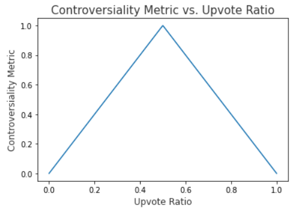

  ____          _     _ _ _     ____        _          ____                                 
 |  _ \ ___  __| | __| (_) |_  |  _ \  __ _| |_ __ _  / ___|  ___ _ __ __ _ _ __   ___ _ __ 
 | |_) / _ \/ _` |/ _` | | __| | | | |/ _` | __/ _` | \___ \ / __| '__/ _` | '_ \ / _ \ '__|
 |  _ <  __/ (_| | (_| | | |_  | |_| | (_| | || (_| |  ___) | (__| | | (_| | |_) |  __/ |   
 |_| \_\___|\__,_|\__,_|_|\__| |____/ \__,_|\__\__,_| |____/ \___|_|  \__,_| .__/ \___|_|   
                                                                           |_|              

# RDS
Reddit Data Scraper [RDS]: A program to scrape historical text data from reddit.

### Dependencies

### Notes
*Downvotes*: Because downvotes are not actually given, downvotes are calculated using the number of upvotes and the upvote ratio. Often this calculation results in a non-integer value, thus, one should not treat downvotes as exact, as they are often rounded from float values.

*Controversiality*: The controversiality figure is a simple function that maps the upvote ratio onto a controversiality scale between 0 and 1. It is assumed that upvote ratio values near 0, and near 1, are less controversial because they are either unanimously liked or unanimously disliked. Upvote ratio values near 0.5 would be more controversial, as there is no true agreement as to whether the post in question is worthy of upvotes or downvotes. As such, the function is graphically represented as follows:

